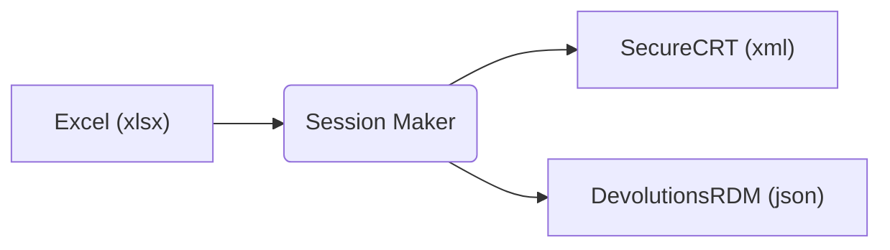
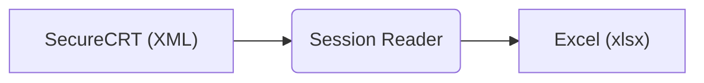

# SessionMaker

<!-- ```
 _____               _            ___  ___      _
/  ___|             (_)           |  \/  |     | |
\ `--.  ___  ___ ___ _  ___  _ __ | .  . | __ _| | _____ _ __
 `--. \/ _ \/ __/ __| |/ _ \| '_ \| |\/| |/ _` | |/ / _ \ '__|
/\__/ /  __/\__ \__ \ | (_) | | | | |  | | (_| |   <  __/ |
\____/ \___||___/___/_|\___/|_| |_\_|  |_/\__,_|_|\_\___|_|

```                                                                 -->

- [SessionMaker](#sessionmaker)
  - [Description](#description)
  - [Session Maker](#session-maker)
    - [Usage](#usage)
    - [Example](#example)
  - [Session Reader](#session-reader)
    - [Usage](#usage-1)
    - [Example](#example-1)
  - [Excel workbook structure](#excel-workbook-structure)
    - ['sessions' worksheet columns](#sessions-worksheet-columns)
    - ['rdm-credentials' worksheet columns](#rdm-credentials-worksheet-columns)
    - ['scrt-credentials' worksheet columns](#scrt-credentials-worksheet-columns)
    - ['scrt-firewalls' worksheet columns](#scrt-firewalls-worksheet-columns)
  - [Configuration](#configuration)
  - [Versioning](#versioning)
  - [Authors](#authors)
  - [License](#license)

## Description

Excel workbook to SecureCRT and/or Devolutions RDM sessions (and vice-versa) converter. The goal of the project is to make life easier for network engineers ;).

There are two parts:

- [**Session Maker**](#session-maker) - Generate SecureCRT XML or Devolutions RDM JSON file from Excel book source (Excel -> XML/JSON)
- [**Session Reader**](#session-reader) - Generate Excel book from SecureCRT XML sessions export file (XML -> Excel)

Supported features:

- Folders (paths to session)
- SSH sessions only
- Username and/or Credentials (SecureCRT, Devolutions RDM)
- Firewall groups (SecureCRT)
- Colorscheme and keywords to session (SecureCRT)

> **Important:**<br>
> Session Reader or Session Maker never works with sensitive data (e.g. passwords)! There is possible define only usernames (including credentials).

## Session Maker

Reads Excel workbook and generate SecureCRT sessions content (XML) or Devolutions RDM connections (JSON).



### Usage

It is simple - read help :).

```
$ python3 session_maker.py -h
usage: session_maker.py [-h] [--config CONFIG] [--type {scrt,rdm}] [--write DESTINATION | -p] [-q | -v] source

Read Excel file (source) and generate sessions XML file for [SecureCRT|Devolutions].

positional arguments:
  source                Source (XLS) file

options:
  -h, --help            show this help message and exit
  --config CONFIG       Configuration settings file (default=config.yaml)
  --type {scrt,rdm}     Destination type: scrt=SecureCRT (default), rdm=DevolutionsRDM
  --write DESTINATION, -w DESTINATION
                        Write to file. If not specified, write to 'export' subfolder as the source.
  -p, --print           Print to screen only (don't write it to the file).
  -q, --quiet           Quiet output.
  -v, --verbose         Verbose output. (use: -v, -vv)
```

XML content can be exported to:

- **file**: option `--write`. if not defined, the file is stored in `export` subfolder
- **stdout**: option `--print`

### Example

<details>
  <summary>Show example</summary>

**Source file**

Excel (source) file:

```
$ ls data/EXAMPLE/
devices.xlsx
```

**Build process**

Build XML content for SecureCRT from Excel source:

```
$ python3 session_maker.py  data/EXAMPLE/devices.xlsx
Reading arguments...
Done.
Exporting sessions for SecureCRT...
Exported: 5 sessions, 2 credential groups, 2 firewall groups.
Done.
```

**Destination file**

XML file is exported to `export` subfolder (because option `--write` or `--print` is not defined):

```
$ ls data/EXAMPLE/export/
devices.xml
```

</details>

## Session Reader

Reads SecureCRT sessions file (SecureCRT menu: `Tools -> Export settings...`) and export it to Excel workbook.



### Usage

```
$ python session_reader.py -h
usage: session_reader.py [-h] [--config CONFIG] [-w DESTINATION] [-q | -v] source

Read SecureCRT sessions XML file (source) and export it to Excel file (write to destination).

positional arguments:
  source                SecureCRT sessions XML file (export from SecureCRT).

options:
  -h, --help            show this help message and exit
  --config CONFIG       Configuration settings file (default=config.yaml)
  -w DESTINATION, --write DESTINATION
                        Write to destination Excel (xlsx) file. If not defined, write to the 'export' subfolder.
  -q, --quiet           Quiet output.
  -v, --verbose         Verbose output (use: -v, -vv).
```

If `--write` option is not defined, destination file is exported to `export` subfolder.

### Example

<details>
  <summary>Show example</summary>

**Source file**

SecureCRT (source) file (it is previously generated Excel file):

```
$ ls data/EXAMPLE/export/
devices.xml
```

**Build process**

Generate Excel file from SecureCRT XML source file:

```
$ python session_reader.py data/EXAMPLE/export/devices.xml
Reading arguments...
Done.
Read SecureCRT sessions XML file...
Done. Imported: 5 sessions, 2 credential groups, 2 firewall groups.
Writing Excel file...
Done.
```

**Destination file**

Excel workbook is exported to `export` subfolder (because option `--write` is not defined):

```
$ ls data/EXAMPLE/export/export/
devices.xlsx
```
</details>

## Excel workbook structure

Excel workbook contains 4 worksheets:

- **[sessions](#sessions-worksheet-columns)**: list of device sessions
- **[rdm-credentials](#rdm-credentials-worksheet-columns)**: Devolutions RDM credentials list
- **[scrt-credentials](#scrt-credentials-worksheet-columns)**: SecureCRT credential groups list
- **[scrt-firewalls](#scrt-firewalls-worksheet-columns)**: SecureCRT firewall groups list

> **Note:** <br>
> All column names described below can be changed in `config.yaml` file.

### 'sessions' worksheet columns

| column name      | required | default | description                                            |
| ---------------- | :------: | ------- | ------------------------------------------------------ |
| folder           |          |         | Path/hierarchy to session                              |
| session          |   yes    |         | Session name                                           |
| hostname         |          |         | Device hostname (DNS name or IP address)               |
| port             |          | 22      | TCP port                                               |
| username         |          |         | Username                                               |
| rdm credential   |          |         | RDM: Credential name                                   |
| credential group |          |         | SCRT: Credential group name                            |
| colorscheme      |          |         | SCRT: Color Scheme name                                |
| keywords         |          |         | SCRT: Keyword Highlighting List name                   |
| firewall group   |          |         | SCRT: Firewall group or Session name (path/to/session) |

### 'rdm-credentials' worksheet columns

| column name     | required | default | description        |
| --------------- | :------: | ------- | ------------------ |
| folder          |          |         | Path to credential |
| credential name |   yes    |         | Credential name    |
| username        |          |         | Username           |

### 'scrt-credentials' worksheet columns

| column name      | required | default | description           |
| ---------------- | :------: | ------- | --------------------- |
| credential group |   yes    |         | Credential group name |
| username         |          |         | Username              |

### 'scrt-firewalls' worksheet columns

| column name    | required | default | description            |
| -------------- | :------: | ------- | ---------------------- |
| firewall group |   yes    |         | Firewall group name    |
| address        |          |         | IP address or DNS name |
| port           |          |         | TCP port               |
| username       |          |         | Username               |

## Configuration

Excel worksheet names, column names and SecureCRT custom settings (not configurable by Session Maker) are configurable. For more detials see [config.yaml](config.yaml) file.

## Versioning

This project use [SemVer](http://semver.org/) for versioning. For the versions available, see the tags on main repository.

## Authors

- **Martin Kyrc** - 2022 - [@mkyrc](https://github.com/mkyrc) on Github

## License

This project is licensed under the MIT License - see the [LICENSE.txt](LICENSE.txt) file for details.
