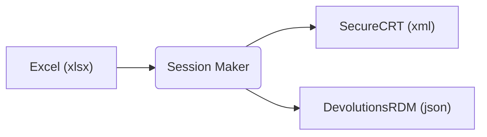
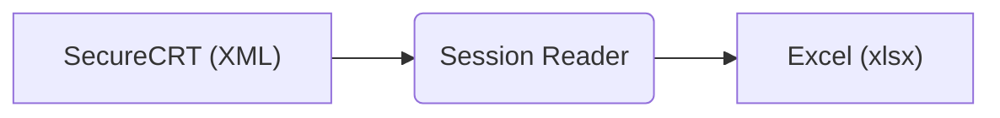

# SessionMaker

<!-- ```
 _____               _            ___  ___      _
/  ___|             (_)           |  \/  |     | |
\ `--.  ___  ___ ___ _  ___  _ __ | .  . | __ _| | _____ _ __
 `--. \/ _ \/ __/ __| |/ _ \| '_ \| |\/| |/ _` | |/ / _ \ '__|
/\__/ /  __/\__ \__ \ | (_) | | | | |  | | (_| |   <  __/ |
\____/ \___||___/___/_|\___/|_| |_\_|  |_/\__,_|_|\_\___|_|

```                                                                 -->

- [SessionMaker](#sessionmaker)
  - [Description](#description)
    - [Important news](#important-news)
    - [Supported features](#supported-features)
  - [Session Maker](#session-maker)
    - [Usage](#usage)
    - [Example](#example)
  - [Session Reader](#session-reader)
    - [Usage](#usage-1)
    - [Example](#example-1)
  - [Excel workbook structure](#excel-workbook-structure)
    - ['sessions' worksheet columns](#sessions-worksheet-columns)
    - ['rdm-credentials' worksheet columns](#rdm-credentials-worksheet-columns)
    - ['scrt-credentials' worksheet columns](#scrt-credentials-worksheet-columns)
    - ['scrt-firewalls' worksheet columns](#scrt-firewalls-worksheet-columns)
  - [Configuration](#configuration)
  - [Versioning](#versioning)
  - [Authors](#authors)
  - [License](#license)

## Description

Excel workbook to SecureCRT and/or Devolutions RDM sessions (and vice-versa) converter. The goal of the project is to make life easier for network engineers ;-).

> **Important:**<br>
> Session Reader or Session Maker never works with secreds/password! There is possible define only usernames (including credentials).

There are two parts:

- [**Session Maker**](#session-maker) - Generate SecureCRT `XML` or Devolutions RDM `JSON` file from Excel book source (Excel -> XML/JSON)
- [**Session Reader**](#session-reader) - Generate Excel book from SecureCRT `XML` sessions export file (XML -> Excel).

### Changelog

- Starting version 0.3.0, are worksheets or/and column names for unused settings not required.
- Starting version 0.4.0, are supported new RDM object types: "host object" and "PowerShell script before open"
- Starting version 0.5.0, can user define session defaults in the file

For more details see [CHANGELOG.md](CHANGELOG.md) file.

### Supported features

| Feature            | SecureCRT | Devolution RDM | Description                                                 |
| ------------------ | :-------: | :------------: | ----------------------------------------------------------- |
| Folders            |    yes    |      yes       | Path to session (or any other object, e.g. credentials,...) |
| Username           |    yes    |      yes       | Username (not used when credentials is defined)             |
| Credentials        |    yes    |      yes       | Credentials definitions (higher preference than username)   |
| SSH Session        |    yes    |      yes       | SSH session support                                         |
| RDP Session        |    no     |      yes       | RDP session support                                         |
| WEB Session        |    no     |      yes       | WEB session support                                         |
| Script             |    no     |      yes       | PowerShell script before login support                      |
| Colorscheme        |    yes    |       no       | Terminal colorscheme                                        |
| Keywords           |    yes    |       no       | Keyword highlighting (per session)                          |
| Firewall groups    |    yes    |       no       | Firewall groups definition (SecureCRT feature)              |
| User Customization |    no     |      yes       | User can define [session defaults](#session-defaults)       |

> **Note:**<br>
> Some Excel (including RAW fields) is possibe to define by user. For more details see [Session defaults](#session-defaults).

## Session Maker

Reads Excel workbook and generate SecureCRT sessions content (XML file) or Devolutions RDM connections (JSON file).



### Usage

It is simple - read help :).

```
$ python3 session_maker.py -h
usage: session_maker.py [-h] [--config CONFIG] [--type {scrt,rdm}] [--write DESTINATION | -p] [-q | -v | --version] source

Read Excel file (source) and generate sessions XML file for [SecureCRT|Devolutions].

positional arguments:
  source                Source (XLS) file

options:
  -h, --help            show this help message and exit
  --config CONFIG       Configuration settings file (default=config.yaml)
  --type {scrt,rdm}, -t {scrt,rdm}
                        Destination type: scrt=SecureCRT (default), rdm=DevolutionsRDM
  --write DESTINATION, -w DESTINATION
                        Write to file. If not specified, write to 'export' subfolder as the source.
  -p, --print           Print to screen only (don't write it to the file).
  -q, --quiet           Quiet output.
  -v, --verbose         Verbose output. (use: -v, -vv)
  --version             show program's version number and exit
```

XML content can be exported to:

- **file**: Option `--write`. If not defined, the file is stored in `export` subfolder
- **stdout**: Option `--print`.

### Example

<details>
  <summary>Show Excel -> SecureCRT example</summary>

**Source file**

Excel (source) file:

```
$ ls data/EXAMPLE/
devices-v0.3.x.xlsx
```

**Build process**

Build XML content for SecureCRT from Excel source:

```
$ python3 session_maker.py data/EXAMPLE/devices-v0.3.x.xlsx
Reading arguments...
Done.
Reading Excel book...
Done: 4 sessions (ssh: 4), 2 credential group(s), 0 firewall group(s) from Excel.
Building sessions...
Done.
Writing to 'data/EXAMPLE/export/devices-v0.3.x.xml'...
Done.
```

**Destination file**

XML file is exported to `export` subfolder (because option `--write` or `--print` is not defined):

```
$ ls data/EXAMPLE/export/
devices-v0.3.x.xml
```

</details>

<details>
  <summary>Show Excel -> Devolution RDM example</summary>

**Source file**

Excel (source) file:

```
$ ls data/EXAMPLE/
devices-v0.3.x.xlsx
```

**Build process**

Build XML content for SecureCRT from Excel source:

```
$ python3 session_maker.py data/EXAMPLE/devices-v0.3.x.xlsx --type rdm

Reading arguments...
Done.
Reading Excel book...
Done. 12 session(s) (ssh: 4, rdp: 4, web: 4), 2 credential(s) from Excel.
Building sessions...
Done.
Writing to 'data/EXAMPLE/export/devices-v0.3.x.json'...
Done.
```

**Destination file**

JSON file is exported to `export` subfolder (because option `--write` or `--print` is not defined):

```
$ ls data/EXAMPLE/export/
devices-v0.3.x.json
```

</details>

## Session Reader

Reads SecureCRT sessions XML file (SecureCRT menu: `Tools -> Export settings...`) and export it to Excel workbook.



### Usage

```
$ python session_reader.py -h
usage: session_reader.py [-h] [--config CONFIG] [-w DESTINATION] [-q | -v] source

Read SecureCRT sessions XML file (source) and export it to Excel file (write to destination).

positional arguments:
  source                SecureCRT sessions XML file (export from SecureCRT).

options:
  -h, --help            show this help message and exit
  --config CONFIG       Configuration settings file (default=config.yaml)
  -w DESTINATION, --write DESTINATION
                        Write to destination Excel (xlsx) file. If not defined, write to the 'export' subfolder.
  -q, --quiet           Quiet output.
  -v, --verbose         Verbose output (use: -v, -vv).
```

If `--write` option is not defined, destination file is exported to `export` subfolder.

### Example

<details>
  <summary>SecureCRT (XML) -> Excel example</summary>

**Source file**

SecureCRT (source) file (it is previously generated Excel file):

```
$ ls data/EXAMPLE/export/
devices-v0.3.x.xml
```

**Build process**

Generate Excel file from SecureCRT XML source file:

```
$ python3 session_reader.py data/EXAMPLE/export/devices-v0.3.x.xml
Reading arguments...
Done.
Reading SecureCRT sessions XML file...
Done. 4 session(s), 2 credential group(s), 0 firewall group(s) from XML file.
Writing Excel file...
Done.
```

**Destination file**

Excel workbook is exported to `export` subfolder (because option `--write` is not defined):

```
$ ls data/EXAMPLE/export/export/
devices.xlsx
```

</details>

## Excel workbook structure

Excel workbook contains 4 worksheets:

- **[sessions](#sessions-worksheet-columns)**: list of device sessions
- **[rdm-credentials](#rdm-credentials-worksheet-columns)**: Devolutions RDM credentials list
- **[scrt-credentials](#scrt-credentials-worksheet-columns)**: SecureCRT credential groups list
- **[scrt-firewalls](#scrt-firewalls-worksheet-columns)**: SecureCRT firewall groups list

> **Note:** <br>
> All column names described below can be changed in [config.yaml](config.yaml) file.

### 'sessions' worksheet columns

| column name (Excel)     | required | default    | description                                                    |
| ----------------------- | :------: | ---------- | -------------------------------------------------------------- |
| folder                  |          |            | Path/hierarchy to session                                      |
| session                 |   yes    |            | Session name                                                   |
| hostname                |          |            | Device hostname (DNS name or IP address)                       |
| type                    |   yes    |            | Session type: [ssh \| rdp \| web]                              |
| port                    |          | 22 or 3389 | TCP port (default: 22 for SSH, 3389 for RDP, not used for WEB) |
| username                |          |            | Username                                                       |
| rdp alternate shell     |          |            | RDP alternative shell                                          |
| **Devolution RDM only** |
| rdm credential          |          |            | Credential object name                                         |
| rdm host                |          |            | Host object name                                               |
| rdm script before open  |          |            | PowerShell script before open path                             |
| web login form          |          |            | WEB session: Login form name (HTML id)                         |
| web login field         |          |            | WEB session: Login field name (HTML id)                        |
| web passwd field        |          |            | WEB session: Password field name (HTML id)                     |
| **SecureCRT only**      |
| scrt credentials        |          |            | Credential group name                                          |
| scrt colorscheme        |          |            | Color Scheme name                                              |
| scrt keywords           |          |            | Keyword Highlighting List name                                 |
| scrt firewall group     |          |            | Firewall group or Session name (path/to/session)               |

> **Note:**
> For details see `['excel']['col_names_sessions']` in [config.yaml](config.yaml) file.

### 'rdm-credentials' worksheet columns

| column name     | required | default | description               |
| --------------- | :------: | ------- | ------------------------- |
| folder          |          |         | Path to credential object |
| credential name |   yes    |         | Credential name           |
| username        |          |         | Username                  |

> **Note:**
> For details see `['excel']['col_names_rdm_credentials']` in [config.yaml](config.yaml) file.

### 'rdm-host' worksheet columns

| column name    | required | default | description                |
| -------------- | :------: | ------- | -------------------------- |
| folder         |          |         | Path to RDM host object    |
| name           |   yes    |         | RDM Host object name       |
| host           |   yes    |         | IP od hostname             |
| rdm credential |          |         | RDM Credential object path |

> **Note:**
> For details see `['excel']['col_names_rdm_credentials']` in [config.yaml](config.yaml) file.

### 'scrt-credentials' worksheet columns

| column name      | required | default | description           |
| ---------------- | :------: | ------- | --------------------- |
| credential group |   yes    |         | Credential group name |
| username         |          |         | Username              |

> **Note:**
> For details see `['excel']['col_names_scrt_credentials']` in [config.yaml](config.yaml) file.

### 'scrt-firewalls' worksheet columns

| column name    | required | default | description            |
| -------------- | :------: | ------- | ---------------------- |
| firewall group |   yes    |         | Firewall group name    |
| address        |          |         | IP address or DNS name |
| port           |          |         | TCP port               |
| username       |          |         | Username               |

> **Note:**
> For details see `['excel']['col_names_scrt_firewalls']` in [config.yaml](config.yaml) file.

## Custom configuration

### Excel column names

Excel worksheet and/or column names and SecureCRT custom settings (not configurable by Session Maker) is possible to customize in [config.yaml](config.yaml) file.

### Session defaults

Starting version 0.5.0, the user can define default settings in the `session_defaults/rdm.d` folder in the `*.yaml` file(s). It is possible to configure defaults for sessions only (selected columns in `sessions` Excel worksheet including full RAW access to JSON fields).

For more details see [session_defaults](session_defaults) folder.

### RDM supported fields

| configuration object   | session type | supported | description                       |
| ---------------------- | ------------ | :-------: | --------------------------------- |
| **Excel (`sessions)`** |
| folder                 | ssh, rdp     |    no     |                                   |
| session                | ssh, rdp     |    no     |                                   |
| type                   | ssh, rdp     |    no     |                                   |
| port                   | ssh, rdp     |    yes    |                                   |
| rdm credential         | ssh, rdp     |    yes    |                                   |
| rdm host               | ssh, rdp     |    yes    |                                   |
| rdm script before open | ssh, rdp     |    yes    |                                   |
| web login form         | ssh, rdp     |    no     |                                   |
| web login field        | ssh, rdp     |    no     |                                   |
| web password field     | ssh, rdp     |    no     |                                   |
| **RAW (JSON)**         |
| _no limit_             | ssh, rdp     |    yes    | There is no limit for JSON fields |

### SCRT supported fields

TODO

## Versioning

This project use [SemVer](http://semver.org/) for versioning. For the versions available, see the tags on main repository.

## Author

- 2022-2024, Martin Kyrc ([@mkyrc](https://github.com/mkyrc))

## License

This project is licensed under the MIT License - see the [LICENSE.txt](LICENSE.txt) file for details.
